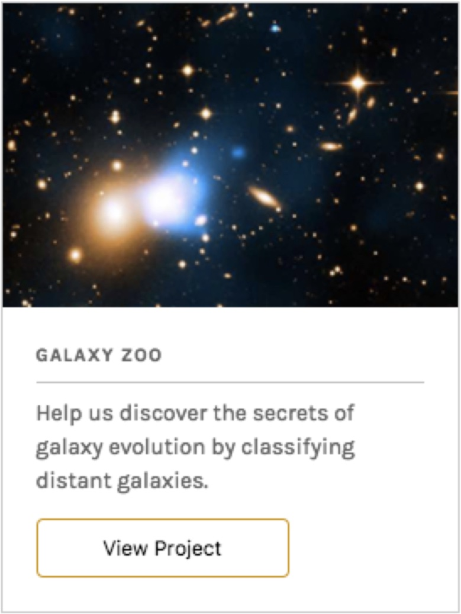

# ProjectCard



Accepts the following props:

- `colorTheme` (string) - color theme to use with the modal. Defaults to `light`
- `theme` (object) - Grommet theme to use. Defaults to `@zooniverse/grommet-theme`

## Example

```js
<ProjectCard />
```
